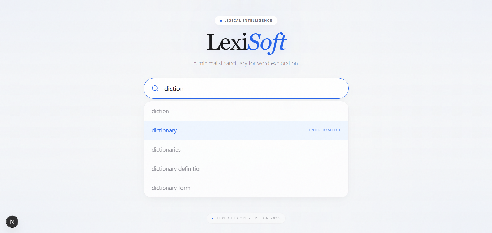
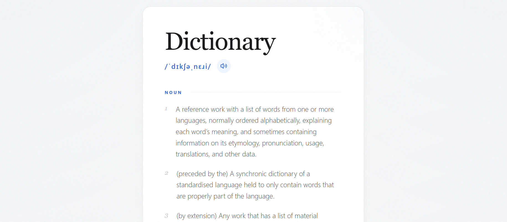

# LexiSoft

**LexiSoft** is a minimalist, high-aesthetic dictionary sanctuary designed for modern word exploration. Built with Next.js 16 and Tailwind CSS v4, it focuses on providing a "Lexical Intelligence" experience through a polished, ethereal interface.



## ✨ Features

- **Ethereal UI:** A clean, focused interface with mesh gradients, noise overlays, and sophisticated typography.
- **Smart Typeahead:** Real-time "ghost text" predictions as you type to help prevent spelling mistakes.
- **Instant Autocomplete:** Press `Tab` or `Right Arrow` to instantly complete the predicted word.
- **Fluid Layout Transitions:** Cinematic shifts and lifting effects when results appear.
- **Live Suggestions:** Powered by the Datamuse API for high-quality word recommendations.
- **Deep Definitions:** Comprehensive word data including phonetics, audio pronunciations, meanings, synonyms, and antonyms.
- **Auto-Scroll Experience:** Automatically scrolls to definitions upon search for immediate accessibility.



## 🚀 Tech Stack

- **Framework:** [Next.js 16](https://nextjs.org/) (App Router)
- **Library:** [React 19](https://react.dev/)
- **Styling:** [Tailwind CSS v4](https://tailwindcss.com/)
- **Animations:** [Framer Motion](https://www.framer.com/motion/) & [GSAP](https://gsap.com/)
- **Icons:** [Lucide React](https://lucide.dev/)
- **APIs:** Datamuse API & Free Dictionary API

## 🛠️ Getting Started

First, install dependencies:

```bash
npm install
```

Then, run the development server:

```bash
npm run dev
```

Open [http://localhost:3000](http://localhost:3000) with your browser to see the result.

## 📖 License

This project is open-source and available under the MIT License.

---
*LexiSoft Core &bull; Edition 2026*

